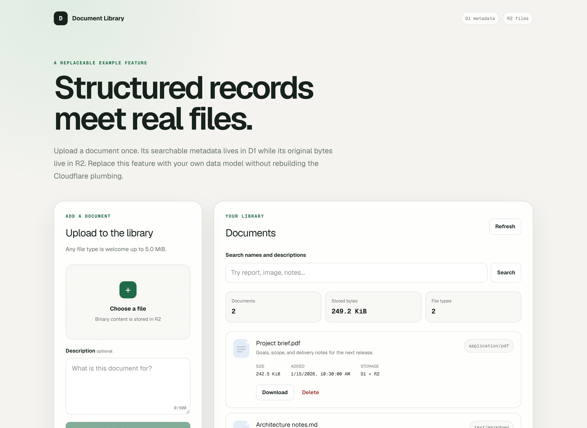

# D1 + R2 starter factory

One source tree produces two ready-to-use TypeScript starters for pairing searchable metadata in [Cloudflare D1](https://developers.cloudflare.com/d1/) with binary file content in [Cloudflare R2](https://developers.cloudflare.com/r2/).



This repository is the canonical source, test, and publication history for both editions. Start a project from one of the generated template repositories:

| Edition | Runtime | Template |
| --- | --- | --- |
| ChatGPT Sites | Vinext on managed Sites hosting | [`d1-r2-starter-openai`](https://github.com/j-256/d1-r2-starter-openai) |
| Cloudflare Workers | Hono deployed with Wrangler | [`d1-r2-starter-wrangler`](https://github.com/j-256/d1-r2-starter-wrangler) |

Both editions contain the same document-library vertical slice: upload binary files, search D1 metadata, download R2 objects, and delete both sides through a tested service boundary. They share feature contracts, validation, persistence, HTTP semantics, migrations, and buildless core tests while keeping runtime composition, routing, authorization, and UI explicit.

## Why a factory

The generated repositories are intentionally simple starting points. The machinery that keeps them synchronized lives here:

- **Explicit variant generation.** Shared feature code is combined with runtime-owned presentation and overlays, then scanned for framework residue and factory-only files.
- **Generated-tree verification.** Each emitted edition runs its shared tests in place, the Wrangler edition installs its pinned dependencies and typechecks with its emitted toolchain, and the Sites artifact is checked for its Worker entry point, hosting manifest, and packaged migration history.
- **Checkpoint replay.** Each template records its own verified factory cursor. Publication regenerates intervening factory commits and retains only checkpoints that change that edition.
- **Guarded publication.** Planned trees and complete diffs are reviewed before each template receives one remote push. Fresh-history replacement uses an exact lease and a verified bare recovery mirror.
- **Independent downstream validation.** CI and security scanning run in the factory and in each generated repository so output-specific defects remain visible.

## Source model

```text
shared feature, platform contracts, migrations, and tests
                         |
              +----------+----------+
              |                     |
              v                     v
    ChatGPT Sites shell     variants/wrangler overlay
              |                     |
              v                     v
  d1-r2-starter-openai   d1-r2-starter-wrangler
```

- `features/documents/`, `platform/`, `db/`, `drizzle/`, and `test/` are shared product source.
- The repository root also contains the executable ChatGPT Sites shell used to validate the managed-hosting edition.
- `variants/openai/` owns presentation that differs between the public Sites template and this factory.
- `variants/wrangler/` owns the Hono worker, static interface, package metadata, Wrangler configuration, and edition documentation.
- `scripts/generate.mjs` emits both complete trees under `dist/` and fails if either retains forbidden residue.
- `scripts/publish-template.mjs` compares, prepares, publishes, and verifies the template repositories.

The generated repositories are publication outputs. Report issues and propose source changes [in this factory](https://github.com/j-256/d1-r2-starter-factory/issues) rather than editing a template repository directly.

## Develop and verify

Install the pinned dependencies and run the shared feature suite:

```bash
npm ci
npm test
```

Exercise the factory tooling and emit both templates:

```bash
npm run test:generate
npm run generate
```

Run the remaining CI checks against the Sites shell:

```bash
npm run lint
npm run test:build
```

The generator creates ignored `dist/openai/` and `dist/wrangler/` trees. It removes the factory's publication tooling and any local Sites project linkage before validating the reusable outputs.

## Publish templates

Template publication is a guarded maintainer workflow, not a normal development command. Read [the publishing runbook](docs/PUBLISH.md) before using it.

The default command preserves relevant factory checkpoints in both downstream histories:

```bash
npm run template:publish
```

It requires a clean `main` whose commit matches `origin/main`, shows every downstream diff, asks for publication approval, verifies the resulting remote commits, template settings, and downstream Dependabot policy, and only then advances each factory-owned cursor.

## Releases

Factory releases use Semantic Versioning independently of downstream template publication. Before `1.0.0`, a minor version may change the reusable template contract and a patch version is reserved for compatible fixes.

Use `npm version` as the only release entrypoint. To publish the version already declared in `package.json`, run `npm version "$(node -p 'require("./package.json").version')" --allow-same-version`; later releases use `npm version <major|minor|patch>`. Both forms run the clean-main and remote-synchronization guard, repeat the complete release gate, create the version commit and tag, and push both refs atomically. The tag-triggered GitHub Actions workflow verifies the exact tagged factory and creates the published GitHub Release; an explicit workflow dispatch can safely retry an existing tag.

## Project cover automation

The factory cover captures the actual document-library interface with synthetic API responses through a local preview. Capture tooling and its workflow are excluded from the generated templates. Install the capture tooling with `npm ci --prefix tools/cover` and `npm exec --prefix tools/cover -- playwright install chromium`, then run `npm run capture:cover`. Use `-- --output FILE` to write a review image elsewhere. CI captures during source verification and retains the image as an artifact. Successful main builds publish a changed `docs/screenshots/cover.png` with an image-only commit; pull requests render without publishing, and superseded revisions skip publication.

## Cover image density

The project cover is rendered at 4x pixel density while preserving its logical viewport, so enlarged previews retain more detail. Higher density does not increase the displayed text size; use zoom to inspect small labels.

## License

MIT. See [`LICENSE`](LICENSE).
